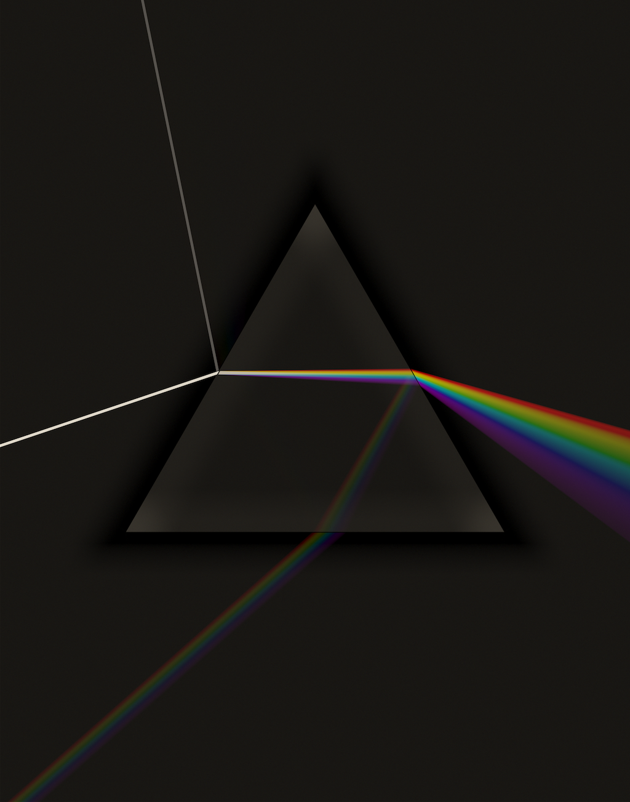

This is a forward ray-tracer to make an image like the cover of the Pink
Floyd album _Dark Side of the Moon_:

Light comes from a point source far off to the left of the image. It goes
through a tiny vertical slit just to the left of the image. ("Vertical"
means "toward the viewer", as if you're looking down on a table.) Each
ray has a random wavelength in the visible spectrum. If the ray hits
the table, it leaves a spot of color according to the wavelength-to-RGB
code from [John D. Cook](https://www.johndcook.com/wavelength_to_RGB.html).
If it hits the prism, it chooses
whether to reflect or refract, according to
[Schlick's approximation](https://en.wikipedia.org/wiki/Schlick%27s_approximation).
The refraction angle is calculated from
[Cauchy's equation](https://en.wikipedia.org/wiki/Cauchy%27s_equation).
The material is Borosilicate glass BK7, except that the `C` term is
multiplied by 10 to get a nice-sized rainbow.

The above alone would leave the prism itself invisible, so 10% of the time
the ray is sent straight down from the viewer, to illuminate the inside of
the prism.

The original album cover didn't include reflections, but I liked them and
left them in. There's no camera model here, the color on the paper is used
directly.

# Build

Build the renderer using CMake:

    % mkdir build
    % cd build
    % cmake ..
    % make

It compiles on MacOS and Linux.

# Running

Run the binary from the `build` directory:

    % build/prism

It will either bring up a UI (if on a Mac and the `UPDATE_DISPLAY`
define is set in the code) or generate PNG file periodically. The
whole program is hacked to generate a single image. Read the comments
to figure out how to modify it.

# License

Copyright 2018 Lawrence Kesteloot

Licensed under the Apache License, Version 2.0 (the "License");
you may not use this file except in compliance with the License.
You may obtain a copy of the License at

   http://www.apache.org/licenses/LICENSE-2.0

Unless required by applicable law or agreed to in writing, software
distributed under the License is distributed on an "AS IS" BASIS,
WITHOUT WARRANTIES OR CONDITIONS OF ANY KIND, either express or implied.
See the License for the specific language governing permissions and
limitations under the License.
